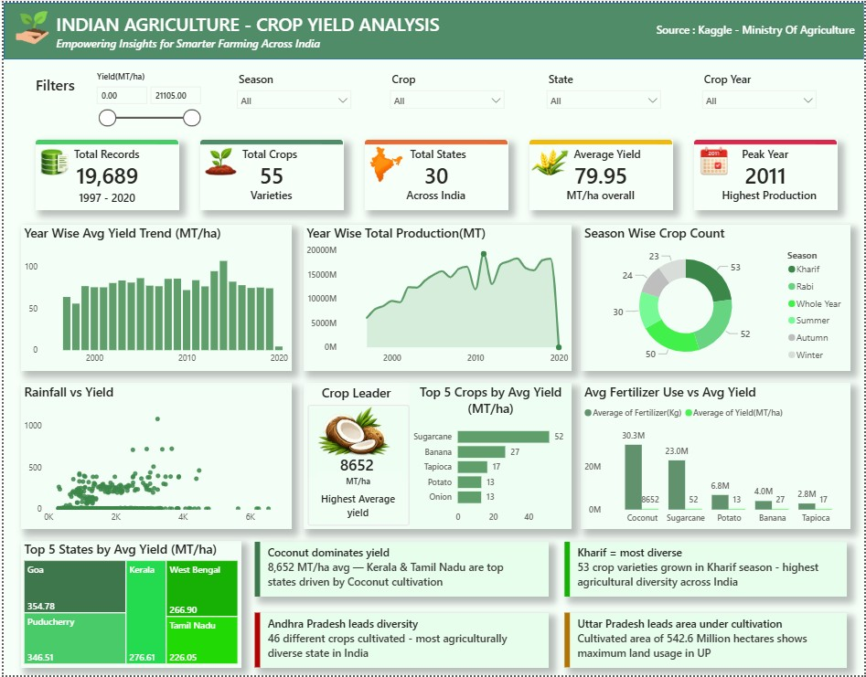

# 🌾 Indian Agriculture — Crop Yield Analysis

> **Empowering Insights for Smarter Farming Across India**

---

## 📌 Project Overview

This project analyzes Indian agricultural data spanning **23 years (1997–2020)** across **30 states** and **55 crop varieties** using SQL and Power BI. The goal is to uncover crop yield patterns, seasonal trends, rainfall impact, and state-wise production insights to support smarter farming decisions.

> ⚠️ **Dataset Note:** This project uses the Indian Agriculture Crop Yield dataset (1997–2020) sourced from Kaggle for practice and learning purposes. The dataset reflects historical agricultural patterns and may not represent current farming practices. In a real-world scenario, this would be replaced with recent data from official sources such as FAOSTAT or data.gov.in.

---

## 🎯 Objectives

- Analyze crop yield trends across states and seasons
- Identify top performing crops and states by yield and production
- Study the impact of rainfall and fertilizer on crop yield
- Uncover seasonal patterns and year-over-year growth trends
- Build an interactive Power BI dashboard for visual storytelling

---

## 🗃️ Dataset

| Feature | Details |
|---------|---------|
| Source | Kaggle — Indian Agriculture Crop Yield Dataset |
| Records | 19,689 rows |
| Time Period | 1997 – 2020 |
| States | 30 Indian states |
| Crops | 55 varieties |
| Seasons | Kharif, Rabi, Whole Year, Summer, Autumn, Winter |

### Columns:
| Column | Type | Description |
|--------|------|-------------|
| Crop | VARCHAR | Name of crop cultivated |
| Crop_Year | INT | Year of cultivation |
| Season | VARCHAR | Cropping season |
| State | VARCHAR | Indian state |
| Area(ha) | INT | Area under cultivation (hectares) |
| Production(MT) | BIGINT | Crop production (metric tons) |
| Annual_Rainfall(mm) | DOUBLE | Annual rainfall in the region (mm) |
| Fertilizer(Kg) | DOUBLE | Fertilizer used (kg) |
| Pesticide(Kg) | DOUBLE | Pesticide used (kg) |
| Yield(MT/ha) | DOUBLE | Crop yield — production per unit area |

---

## 🛠️ Tools Used

| Tool | Purpose |
|------|---------|
| MySQL Workbench | Database creation, data import, SQL queries |
| Power BI | Interactive dashboard and visualizations |

---

## 🔍 SQL Analysis

SQL queries across 8 categories:

| Category | Queries |
|----------|---------|
| Data Exploration | Total records, dataset overview, season distribution |
| Crop Analysis | Top crops by production, yield, area, zero production |
| State Analysis | Top states by yield, production, diversity, area |
| Season Analysis | Production, yield, crop count, area by season |
| Year Trend Analysis | Year wise production, yield, best year per crop |
| Rainfall Impact | Rainfall vs yield, low rainfall states analysis |
| Fertilizer & Pesticide | Top crops by input usage, inputs vs yield |
| Advanced Analysis | Highest yielding crop per state, YoY growth, top crop per season |

---

## 🔑 Key Insights

| # | Insight |
|---|---------|
| 1 | **Coconut dominates yield** — 8,652 MT/ha avg · Kerala & Tamil Nadu are top states |
| 2 | **Kharif = most diverse** — 53 crop varieties · highest agricultural diversity |
| 3 | **Andhra Pradesh leads diversity** — 46 different crops cultivated |
| 4 | **Uttar Pradesh leads area** — 542.6 Million hectares under cultivation |
| 5 | **2004 best growth year** — 13.70% YoY production growth |
| 6 | **Meghalaya highest rainfall** — yet low yield showing rainfall alone doesn't drive productivity |
| 7 | **Wheat uses most pesticide** — 301,283 kg avg across all records |
| 8 | **2011 peak production year** — highest agricultural output recorded |

---

## Files in this Repository
| File | Description |
|------|-------------|
| crop_yield.sql | Main SQL analysis script |
| crop_dataset.csv | Dataset used for analysis |
| crop_yield_dashboard.jpg | Power BI dashboard screenshot |
| dashboard.pbix | Power BI dashboard file |

---

## Visualizations

### Dashboard Overview

---

## Author
**Preethi M**  
Aspiring Data Analyst  
📧 preethiii.m1905@gmail.com  
🔗 [LinkedIn](https://www.linkedin.com/in/preethi-m-9864a3384/)
